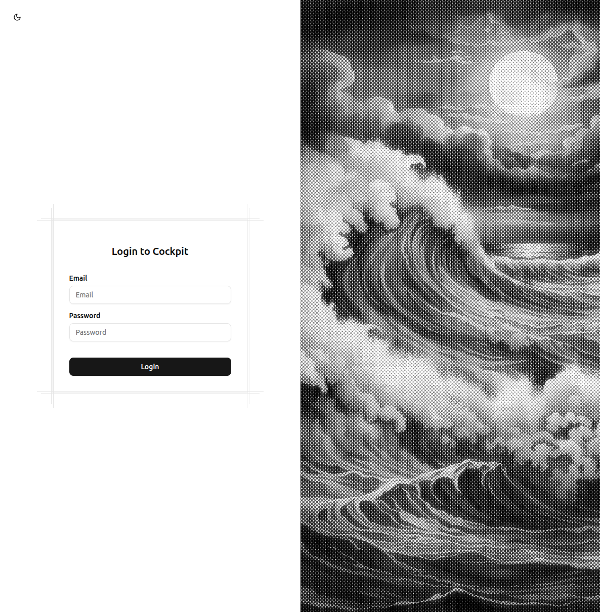

# Habit Tracker — User Guide

**Who this is for**: Marcin and Piotr
**Last updated**: 2026-05-22

---

## Table of Contents

1. [What is the Habit Tracker?](#what-is-the-habit-tracker)
2. [Getting Started](#getting-started)
3. [Today View — Your Daily Dashboard](#today-view)
4. [The Three Habit Types](#the-three-habit-types)
5. [Creating Habits](#creating-habits)
6. [Habits Tab — Managing Your Habits](#habits-tab)
7. [Stats Screen](#stats-screen)
8. [Settings — Push Notifications](#settings)
9. [Streaks Explained](#streaks-explained)
10. [Streak Freeze](#streak-freeze)

---

## What is the Habit Tracker?

The Habit Tracker is a personal web app that helps you build and maintain daily habits. Open it at the end of your day, tap through your habit grid in under two minutes, and keep your streaks alive.

Key things you can do:
- Log habits with a single tap (or a quick number entry, or a diary note)
- See your current streaks and never accidentally break one due to a single busy day
- Browse a library of ready-made habits to get started fast
- Receive push reminders at whatever time works for each individual habit
- Review weekly charts and monthly highlights to see how you are progressing

The app lives at **habits.parda.me** and works on any device — it is designed for phone-sized screens.

---

## Getting Started

### Opening the App

1. Open your browser and go to **habits.parda.me** (or `http://localhost:4208` locally).
2. If you are not already signed in, you will be taken to the login page automatically.

   

3. Enter your username and password and click **Sign In**.
4. You will be taken straight to the Today view.

   

> **Note**: The app requires your Cockpit account. If you see the login page, just sign in and you will be redirected back to the habit tracker automatically.

---

## Today View

The Today view is your home screen. It opens automatically when you visit the app.

### What you see

- A grid of square tiles — one tile per habit — grouped by category (Health, Fitness, Mindfulness, etc.).
- Each tile shows:
  - The habit's icon (centred, 32px)
  - The habit's name below the icon (small text, truncated if long)
  - A flame badge in the top-right corner showing your current streak count

### Tile colors

| State | Appearance |
|---|---|
| Not yet logged today | Muted grey background with a colored border matching the habit's color |
| Logged today | Solid colored background (the habit's own color) with a checkmark overlay |

The color fill animates over 300 ms so it feels satisfying to tap through your list.

### Checking off a habit

- **One tap** — logs the habit immediately (for boolean habits such as "Did I meditate?").
- **Numeric habits** — tapping opens a small panel from the bottom of the screen where you enter a number.
- **Text diary habits** — tapping opens a large writing area from the bottom where you can type a note.

See [The Three Habit Types](#the-three-habit-types) for full details.

### Long-press to see details

Press and hold any tile for about one second to open that habit's detail page, where you can see its full history graph, past entries, and streak breakdown.

### When you finish all habits

Once every habit in today's grid is logged, a brief confetti animation plays as a small celebration.

---

## The Three Habit Types

Every habit has one type, chosen when you create it. The type determines how you log it.

### 1. Boolean ("Did I do it?")

The simplest type. A single tap marks it done. Tap again to undo.

**Examples**: Meditate, Read before bed, Take vitamins, No alcohol

**Check-in experience**: Tap the tile. It turns solid and shows a checkmark. Done.

### 2. Numeric ("How much did I do?")

For habits where the amount matters — distance, reps, minutes, glasses of water, etc. You can set a target so the app shows you how close you are.

**Examples**: Run 5 km, Drink 2 L of water, 50 push-ups, Sleep 8 hours

**Check-in experience**: Tap the tile. A panel slides up from the bottom of the screen (covering roughly half the screen). Type your number. The panel shows your target so you can see at a glance whether you hit it. Tap Save.

### 3. Text Diary ("What happened?")

A free-form journal entry. Useful for reflection, mood notes, or any habit where writing a few words is the whole point.

**Examples**: Gratitude journal, One good thing today, Training notes

**Check-in experience**: Tap the tile. A large writing area opens, taking up nearly the full screen. Start typing — the text saves automatically as you write. Close the panel when you are done.

---

## Creating Habits

Tap the **+** button on the Today view or the Habits tab to open the habit creation panel.

The creation panel has two tabs:

### Quick Add

Fill in the form to create a habit from scratch:

| Field | What to enter |
|---|---|
| Name | The habit name, e.g. "Morning run" |
| Icon | Pick from a scrollable row of icons |
| Color | Pick from 8 color swatches |
| Type | Boolean, Numeric, or Text Diary |
| Category | Choose an existing category or leave blank |
| Target (numeric only) | The number you aim to hit, and the unit (km, reps, min…) |
| Frequency | Daily (default), Weekly, or a custom number of days per week |
| Streak mode | Soft (recommended), Hard, or None — see [Streaks Explained](#streaks-explained) |
| Reminder time | Optional. Pick a time and you will get a push notification on that habit's schedule |

Tap **Create Habit** when done.

### Browse Templates

The app comes with about 25 ready-made habits across five categories: Health, Fitness, Mindfulness, Learning, and Productivity.

- Scroll through the list and tap any template.
- It pre-fills the Quick Add form with sensible defaults (icon, color, type, target where relevant).
- You can adjust anything before saving — the template is just a starting point.

> **Tip**: Browse Templates is a great way to get started. You can always edit the habit later.

---

## Habits Tab

The Habits tab (second icon in the bottom bar) shows all your habits in a list grouped by category.

### What you can do here

- **See all habits** — including ones you have not logged today.
- **Edit a habit** — tap the three-dot menu on any habit row to edit its name, icon, color, type, target, frequency, streak mode, or reminder.
- **Archive a habit** — use the same menu to archive habits you want to pause without deleting. Archived habits disappear from the Today grid. Toggle "Show archived" at the top to see them.
- **Delete a habit** — available in the same menu. This permanently removes the habit and all its history.
- **Manage categories** — tap any category header to rename it or change its color (8 swatches).
- **Create a category** — tap "Add category" at the bottom of the list.

### Drag to reorder

You can change the order habits and categories appear in.

- **Reorder habits within a category** — press and hold the drag handle (the six-dot icon on the right of a habit row), then drag up or down.
- **Reorder categories** — press and hold the category header and drag it to a new position. All habits inside the category move with it.

The new order is saved automatically.

> **Note**: Drag-to-reorder only works on the Habits tab. The Today grid uses the same order you set here.

---

## Stats Screen

The Stats screen (third icon in the bottom bar) gives you an overview of how you are doing across all your habits.

### Today's completion

At the top you will see a percentage showing how many of today's habits you have already logged. For example: "7 / 10 — 70% complete".

### Weekly bar chart

A bar chart showing how many habits you logged each day this week. Useful for spotting which days you tend to slip.

### Streak ranking

A ranked list of all your habits sorted by their current streak — longest at the top. This is useful when you want to prioritise which habits to protect.

### Monthly highlights

A summary of standout moments from the past month: longest streak achieved, most consistent habit, days where you hit 100% completion.

### Per-habit graphs (via detail page)

For a deeper look at any individual habit, long-press its tile on the Today view (or tap it in the Habits tab list) to open the detail page. The detail page shows:

- **Boolean habits** — a GitHub contribution-style heatmap calendar showing every logged day.
- **Numeric habits** — a combined line and bar chart showing your values over time with a reference line for your target.
- **Text diary habits** — a scrollable timeline of your past entries.

You can switch between five time ranges: 7 days, 30 days, 90 days, 6 months, 1 year.

---

## Settings

The Settings screen (fourth icon in the bottom bar) controls push notifications.

### Enabling push notifications

1. Open Settings.
2. Toggle **Enable push notifications** on.
3. Your browser will ask for permission to send notifications — click **Allow**.
4. That's it. The app is now registered to receive reminders.

### Per-habit reminder times

Push notifications are set per habit, not globally. To set a reminder for a specific habit:

1. Go to the Habits tab.
2. Tap the three-dot menu on the habit you want.
3. Tap **Edit**.
4. Set a time in the **Reminder time** field.
5. Save.

From that point on, you will receive a push notification at that time every day (or on the days the habit is scheduled, if you use a custom frequency).

> **Important**: Push notifications only work if you have enabled them in Settings AND allowed them in your browser. Both steps are required.

### Timezone

Your timezone is detected automatically. If reminders are arriving at the wrong time, check the timezone shown in Settings and update it if needed.

---

## Streaks Explained

A streak counts how many consecutive periods (usually days) you have logged a habit without a break.

Every habit has a streak mode. You set this when creating the habit and can change it any time.

### No streak ("None")

The habit is tracked but no streak is counted. Useful for habits you want to log without the pressure of maintaining a run.

### Hard mode

The strictest option. Miss a single day and your streak resets to zero, with no exceptions.

Choose Hard mode when you want maximum accountability — for example, a "no alcohol" or "cold shower" habit where missing once genuinely matters to you.

### Soft mode (recommended, and the default)

One missed day is forgiven automatically. The streak only breaks if you miss two days in a row.

**Example**: You have a 30-day running streak. Life gets in the way on Tuesday — you miss it. On Wednesday you go for a run as normal. Your streak is still 30 + 1 = 31. The single miss is silently forgiven.

If you miss both Tuesday and Wednesday, the streak breaks.

Soft mode is the default because research suggests that one slip does not predict failure — but feeling like a streak is permanently broken often causes people to give up entirely. Soft mode prevents that.

---

## Streak Freeze

A streak freeze lets you protect a streak on a specific day, even if you know you will not be able to log that habit.

### How to use a freeze

1. On the habit's detail page, tap **Apply Streak Freeze** and pick the date you want to freeze.
2. That date is now protected — it counts as neither a completion nor a miss when calculating your streak.

### The monthly limit

You can apply a maximum of **2 streak freezes per habit per calendar month**. This is intentional — freezes are for genuine exceptions, not a way to avoid logging.

- Your 1st and 2nd freeze of the month will go through.
- A 3rd freeze in the same month will be rejected with an error message.

### What a freeze does (and does not do)

- A freeze means the app skips that day entirely when checking your streak — it is as if the day did not exist.
- A freeze does not count as a logged entry. Your completion percentage for that day is unaffected.
- Unused freezes do not carry over to the next month.

---

## Bottom Navigation

The app has four tabs at the bottom of the screen:

| Tab | Icon | What it shows |
|---|---|---|
| Today | Home/grid icon | Your daily habit grid |
| Habits | List icon | All habits, categories, reorder |
| Stats | Chart icon | Completion %, weekly chart, rankings |
| Settings | Gear icon | Push notification controls |

---

## Tips and Best Practices

**Check habits at the same time every day** — the end of day works well because you can log everything in one go rather than throughout the day.

**Start with Browse Templates** — pick 3 to 5 habits you actually want. It is easier to add more later than to feel overwhelmed by a long list you never complete.

**Use Soft mode by default** — hard mode sounds more disciplined but it often backfires. Soft mode keeps you going after an off day.

**Set a reminder for habits you keep forgetting** — go to the habit's edit screen and set a reminder time. The notification arrives even when the app is closed.

**Reorder your most important habits to the top** — the Today grid shows habits in the order you set on the Habits tab. Put the habits you care most about first so you see them immediately.

**Use numeric targets** — for numeric habits, setting a target (e.g. "5 km" for running) gives you a progress bar during check-in, which is more motivating than just entering a number.

---

## Troubleshooting

**I am not receiving push notifications**
- Check that notifications are enabled in Settings.
- Check that your browser has permission: look for a notification icon in your browser's address bar.
- Make sure a reminder time is set on the individual habit (Settings enables push; the reminder time on the habit sets when it fires).

**My streak disappeared**
- If you use Hard mode, a single missed day resets the streak.
- If you use Soft mode, two consecutive missed days reset it.
- Check the habit's detail page to see exactly which days were logged and which were missed.

**I accidentally logged a habit**
- For boolean habits: tap the tile again to undo.
- For numeric and text habits: open the detail page, find today's entry in the log, and delete it.

**I cannot find a habit I created**
- It may be archived. Go to the Habits tab and toggle **Show archived** at the top.

**The app is asking me to log in**
- The habit tracker requires your Cockpit account. Sign in at the login page and you will be redirected back automatically.
